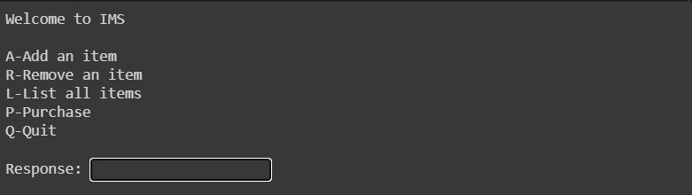
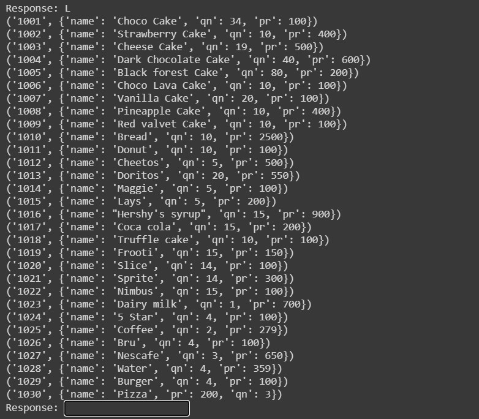
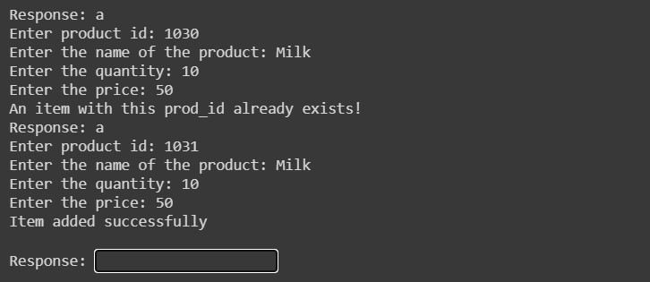
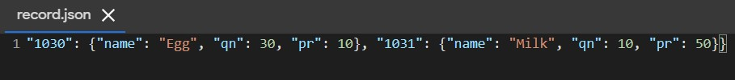
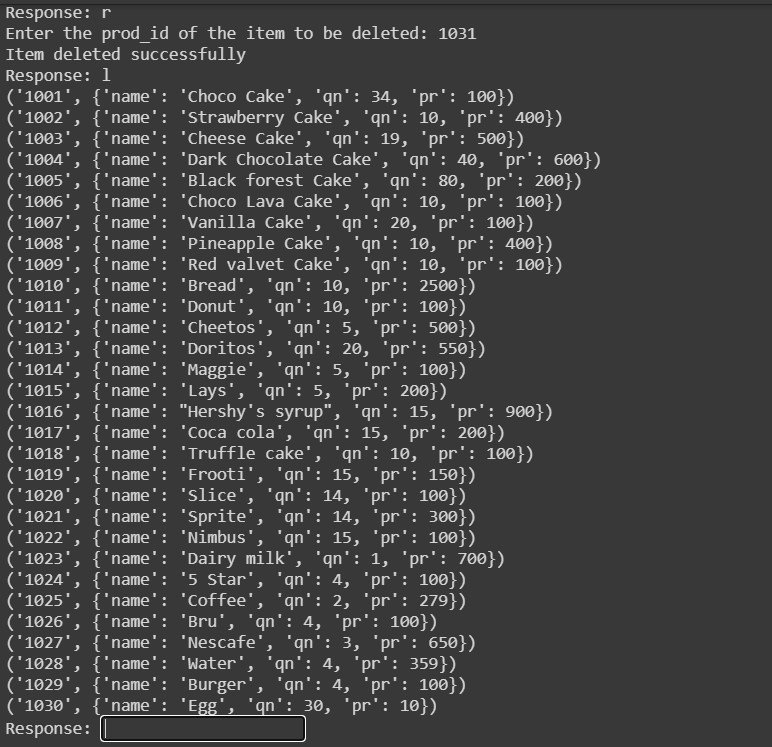
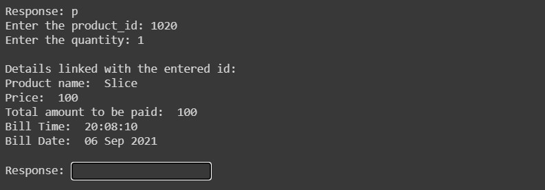
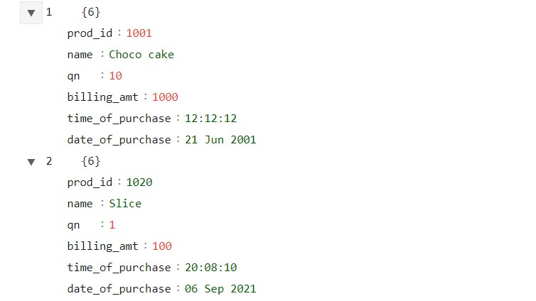

# Inventory Management System

## Introduction
An inventory management system (or inventory system) is the process by which you track your goods throughout your entire supply chain, from purchasing to production to end sales.

## Overview
Tech stack: Python and JSON file to manage stock items and sales.

This project contains a .ipynb file that has complete code and two JSON files to store product-related information [record.json and sales.json]. To run it in your local environment, add the code in your IDE and add the .json files along with the .py file or you can run it in google colab [make sure that you upload the .json files].

## Brief Description
IMS require functionalities like adding a new product in the stock list, removing an item from the stock list, updating a specific detail in a record, purchasing an item, generating an invoice of the purchased item and keeping a record of items sold.
This project contains all the functionalities.

## Features
* User can add a new product.
* Prevents data redundancy.
* User can purchase a new product.
* Generates an Invoice on every purchase.
* Updates the stock quantity after the sale of a product. Sends a message to restock the item, when its _quantity = 0_.

## Product Features
The record.json contains:
1. Product Id
2. Name of the Product
3. Quantity
4. Price

## Transaction Features
The sales.json is updated with the following when a user initiates a purshase:
1. Order Id
2. Product Id
3. Product Name
4. Quantity 
5. Total Billing Amount
6. Billing date
7. Time of purchase

## Screenshots 
### 1. Main Menu

It is a menu-driven IMS, user can perform the task by typing corresponding character in the response field [either in uppercase or in lowercase].

### 2. List of stock

This will display all the items present in the record.json file.

### 3. Adding a new product

Adding a new item requires a _unique_ product id, and other details of the new product.

record.json file is updated with the new product information.

### 4. Removing an entry

Using the _product_id_ an entry is removed. The entry with product_id _1031_ is not present in the list.

### 4. Purchasing a product

Enter the product_id and the quantity. If that quantity is in stock then an invoice is generated with the billing date, time of purchase and other details of the product purschased. 
Inside, records.json the quantity of that particular product gets updated by _record[ui_prod]['qn'] = record[ui_prod]['qn'] - ui_qn_. 

The invoice is pushed to the sales.json with an order id.
